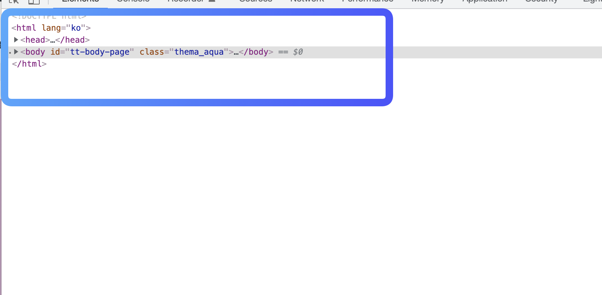

# 웹브라우저의 동작원리

## 브라우저란?

웹브라우저는 동기적으로 HTML, CSS, Javascript 언어를 해석하여 내용을 화면에 보여주는 응용소프트웨어이다.

## 브라우저의 주요 기능

* 사용자가 선택한 자원을 서버에 요청하고 브라우저에 표시하는것
* 자원의 주소는 URI에 의해 정해진다.
* 자원은 HTML, PDF, 이미지 혹은 다른 형태이다.
* 웹 브라우저의 종류는 크롬, 사파리, 파이어폭스, 엣지 등이 있다.

웹브라우저가 웹 서버에 필요한 자원(웹 페이지)을 요청하면 서버는 응답하고 웹 브라우저는 이를 해석한 후 사용자(Client)에게 보여준다.

## 브라우저의 구조

1. 사용자 인터페이스

사용자가 접근할 수 있는 영역으로 URI를 입력할 수 있는 주소 표시줄, 이전/다음 버튼, 북마크 메뉴, 새로 고침 버튼과 현재 문서의 로드를 중단할 수 있는 정지 버튼, 홈 버튼 등 요청한 페이지를 보여주는 창을 제외한 나머지 모든 부분 

이러한 부분들은 표준으로 명시된 UI가 아니다 HTML5에서 주소표시줄과 상태 표시줄등 일반적인 요소를 제외하고 브라우저의 필수 UI를 정의하지 않았지만 수년간 서로의 장점을 모방하며 현재의 브라우저 UI가 생기게 되었다.

2. 브라우저 엔진

사용자 인터페이스와 렌더링 엔진 사이의 동작을 제어한다. Data Storage를 참조하며 로컬에 데이터를 쓰고 읽으며 다양한 작업을 한다. 브라우저 엔진은 브라우저 자체에 동작하는 소프트웨어 구성에 대한 엔진을 말한는 것이고 브라우저 UI를 통해서 렌더링 요청을 하고 동작을 시킬 수 있기 때문에 **사용자 인터페이스와 렌더링 엔진 사이의 동작을 제어한다고 말하는 것이다.**

3. **렌더링 엔진**

웹 서버로부터 응답 받은 자원을 웹 브라우저 상에 나타낸다. 예시로 HTML 문서를 응답받으면 HTML과 CSS를 파싱 하여 화면에 표시 랜더링 엔진의 종류는 여러개가 있지만 대표적으로 웹킷(Webkit)과 게코(Gecko)가 있다 

웹킷은 크롬과 사파리, 게코는 파이어폭스에서 사용된다.

4. 통신

HTTP 요청과 같은, 서버와 통신이 가능하게 하는 네트워크 호출에 사용된다.

5. UI 백엔드

HTTP 요청과 같은, 서버와 통신이 가능하게 하는 네트워크 호출에 사용됩니다. 예를 button이나 input 태그를 쓸때 이 태그에 관한 스타일을 따로 적용하지 않아도 브라우저는 이에 맞는 UI화면을 그리게 된다. 이러한 요소들은 해당 서버나 플랫폼에 명시하지 않은 일반적이 인터페이스이며, OS 사용자 인터페이스 체계를 사용한다.

6. 자바스크립트 해석기

자바스크립트 코드를 해석하고 실행한다.

7. 자료 저장소

Cookie, Local Storage, indexed DB 등 브라우저 메모리를 활용하여 저장하는 영역으로
웹 브라우저 내에서 사용되는 자료 저장 계층이다. HTML5 명세에서 브라우저가 지원하는 클라이언트 스토리지가 사용되도록 정의가 되어 있으며 내용은

* 사용자가 오프라인 상태여도 웹이 작동하도록 한 뒤, 네트워크가 다시 연결되면 데이터를 다시 동기화 할 수 있다.
* 성능 향상을 위해, 동일한 자원에 대한 중복 요청을 줄일 수 있다.
* 서버 인프라가 필요하지 않은 보다 쉬운 모델로 구성되어 있어 사용 효율성이 좋다. 대신 데이터가 취약하고 여러 클라이언트가 액세스 할 수 없으므로, 중요하지 않은 데이터 위주로 사용을 권장

### 렌더링 엔진 동작 과정

렌더링 엔진은 통신으로 부터 요청한 문서의 내용을 얻는 것으로 시작하는데, 문서의 내용은 보통 8KB 단위로 전송된다.

웹킷 렌더링 동작 과정

게코 렌더링 동작 과정

웹킷과 게코를 비교해보면, 기본적인 용어가 다르지만 동작에서 큰 차이는 없다

차이점이라면 게코엔진의 동작 과정중 **콘텐츠 싱크**이다.

웹킷은 HTML과 Style Sheet를 각자 따로 요청 및 파싱 후 합쳐지는 과정이 있지만, 게코는 HTML을 최초로 호출 및 파싱 후, 콘텐츠 싱크 과정을 통해 Style Sheets를 분리해서 작업을 하는 과정이 된다. 하지만 이는 DOM 요소를 생성하는 공정으로 웹킷과 비교하여 의미 있는 차이점이라고 보지 안흔ㄴ다.

#### HTML 파싱

파싱 과정은 어휘분석과 구문 분석으로 나뉘는데 

어휘분석은 의미 없는 공백과 줄 바꿈을 제거하고 토큰(의미있는 문자) 단위로 분해하는 과정이다.

구문분석은 언어의 구문 규칙을 적용하는 과정으로 어휘 분석기로붜 새 톸큰을 받아서 구문 규칙과 일치하는지 확인하는것이다.

이러한 파싱 작업을 렌더링 엔지이 스스로하는 것이 아닌 **파서** 라는 녀석을 통해서 한다.
이때 파서 생성기를 통해 만들어지는다.

파서 생성기는 프로그래밍 언어를 파싱하기 위해 이에 알맞은 파서를 만들어내기 위한 도구로 대표적으로 유닉스 표준 유틸리티인 Lex와 Yacc가 있다

크롬과 사파리에 엔진인 웹킷에서는 어휘 파서 생성기인 플렉스와 문법 파서 생성기인 바이슨을 이용한다. 웹킷에서는 이 두개의 생성기에서 나온 파서를 이용하여 css와 javascript 를 파싱 할수 있게 된다.

html은 전용 파서가 필요하기에 따로 파싱하게 된다. 

#### DTD(Document Type Definition)

HTML의 정의는 DTD 형식 안에 있는데 SGML 계열 언어의 정의를 이용한 것이다. 이 형식은 허용되는 모든 요소와 그들의 속성 그리고 중첩 구조에 대한 정의를 포함한다.

SGML계열의 언어는 국제 표준으로 지정된 마크업 언어의 규약이다

DTD는 SGML 형태인 언어가 어떤 문서 타입인지 알려주는 것이다. DTD를 정의함으로써
해당 문서에 대한 타입을 정의하게 되고 파싱할 때 데이터 교환에 대한 표준으로 활용되며, 파싱할 때 문서의 구문 및 구조에 대한 유효성 검사를 한다.

html 파싱이 되고 파싱트리를 구성하는데 파싱트리를 이용하여 DOM Tree를 만든다

### DOM

DOM(Document Object Model)은 HTML 문서의 객체들을 표현이고 외부를 향하는 자바스크립트와 같은 HTML 요소의 연결 지점이다.

즉 HTML문서에 작성한 문자열 내용들을 브라우저에서 사용할 수 있는 Object 객체 데이터로 형상화 된것이다

HTML과 DOM의 차이점
* HTML은 파일안에 형식에 맞게 작성된 문자열 텍스트
* DOM은 해당 HTML의 텍스트에 맞춰서 생성된 객체 데이터

DOM은 HTML 마크업과 1:1 관계를 맺으므로, HTML 문서로 작성되어 있는 모든 요소가 DOM으로 생성된다

DOM Tree를 이용해서 실제로 화면에 그려질 정보인 Render Tree를 생성해야하는데 이를 위해 Style Sheet 값이 필요로 한다.

### CSS 파싱 

Javascript와 CSS는 문맥 자유문법으로, 이 두 개의 파서 생성기에서 나온 파서를 이용하여 파싱이 가능

CSS 파싱을 진행하게 되면, DOM과 결합하여 별도의 CSSOM(CSS Object Model)이라는 스타일 관련 객체 모델이 생성된다. CSSOM은 HTML의 DOM과 같이 스타일 객체에 접근할 수 있는 인터페이스 객체가 된다.

## Render Tree

HTML과 CSS 파싱이 끝나면 **attechment** 과정으로 넘어가게 되고, 실제 화면에 그려질 정보를 담은 Render Tree를 생성하게 된다.

DOM Tree는 Document의 객체 모델이 부모 자식 관계로 구성된 트리 형태의 객체 데이터 일뿐 Render Tree는 각 DOM 요소들에 상응하는 Style을 참조하며 단순히 화면에 그려질 정보들이 담긴 데이터이다.

Render Tree는 DOM Tree와 1:1로 대응이 일어나지 않는다
* 비시각적인 요소는 제외한다. ex) head, display:none
* 특정 요소에는 여러 렌더러가 필요로 한다.

예를 들어 ~<input type="select">~ 태그를 그리려면 표시영역, 드롭다운 목록, 버튼 표시를 위한 3개의 렌더러가 필요하다. 그리고 한 줄로만 작성했던 문장이 공간 부족으로 인해 줄 바꿈이 생겼을 때, 새로운 줄은 별도의 렌더러로 추가된다.

### 배치

Render Tree가 생성되면, Render Tree에 대한 페이지 배치가 일어난다.

배치란 Render Tree의 각 렌더러의 크기와 위치 정보에 대한 계산을 하는 과정이다.

렌더러들은 자신이 어떻게 그려질지에 대해 정해지기만 하지 위치나 크기는 배치를 통해 정해진다.

#### 배치의 종류

* 전역 배치

전역 배치는 모든 렌더링에 영향을 주는 전역 스타일 변경이 발생할 때 일어나는 배치 과정이다.예를 들어 해당 페이지의 글꼴 크기나 글꼴 스타일이 변경되는 것과 같이, 모든 렌더러에 영향을 주는 전역 스타일을 변경하면 전역 배치가 발생한다. 동기적으로 한 번에 처리 된다.

* 점증 배치

점증 배치는 **더티 렌더러**가 배치되는 경우 일어나는 배치 과정이다.

더티 렌더러는 변경 요소를 브라우저가 지정하여 변경할 특정 렌더러를 뜻한다.

브라우저에서는 소소한 변경 때문에 페이지 전체를 다시 배치하지 안힉 위해서 더티 비트 체제를 사용하는데 예를 들어 네트워크 통신으로부터 추가 데이터를 받아 DOM 트리에 더해지면 새로운 렌더러가 Render Tree에 추가가 되는데 이때 추가된 특정 부분과 이에 관련된 렌더러들만 다시 배치 작업을 하게 되는데 이것을 점증 배치라고 부르며 비동기적으로 일어난다.

## 그리기(Render Tree Painting)

그리기 단계에서는 화면에 내용을 표시하기 위한 Render Tree가 전체적으로 탐색되고, 각 렌더러의 **paint** 메서드가 호출된다. 그리기는 UI 백엔드 요소들을 기반으로 그리기를 시작한다.

각각의 요소들은 블록 렌더러 순서에 따라 그리기 시작하는데 밑에 순서대로 시작한다.
1. 배경 색
2. 배경 이미지
3. 테두리
4. 자식
5. 아웃라인

모든 요소가 그려진 후 브라우저에서 일부 변경이 생길 경우엔, 해당 렌더러와 그 자식의 배치과정과 **repaint** 메서드가 발생하낟.

웹킷에서는 리페인팅 전에 기존의 영역을 비트맵으로 저장하여 새로운 영역과 비교하고 차이가 있는 부분만 다시 그리는 과정을 통해 불필요로한 그리기 요소를 최소화 시킨다.
